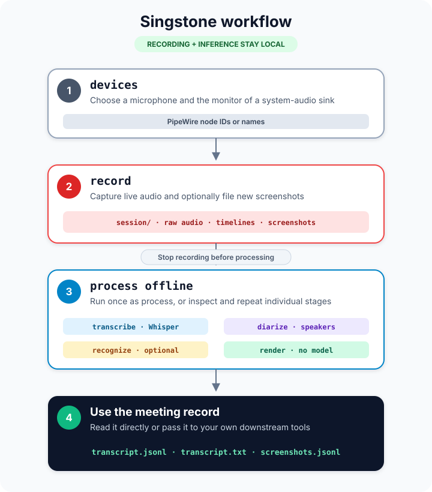
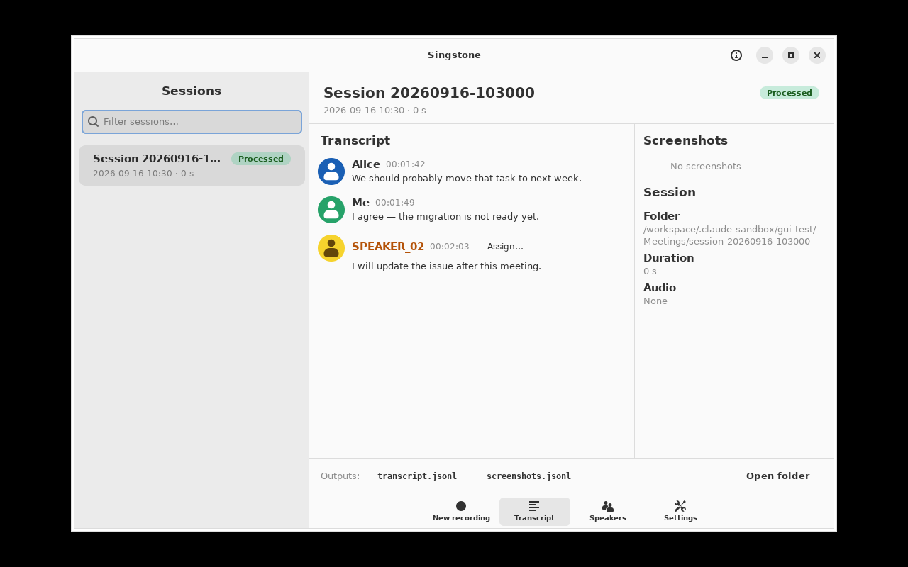
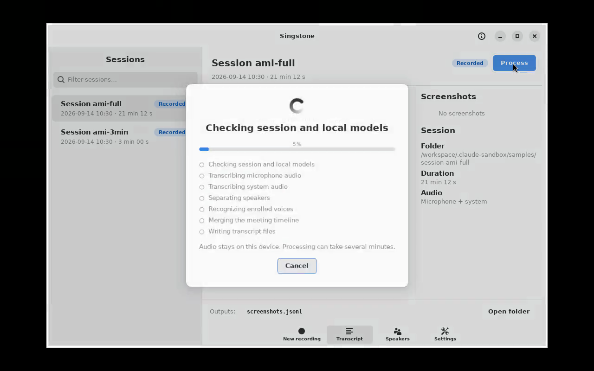

<div align="center">
  <h1>singstone</h1>
  <p>Local meeting recording, transcription, and speaker diarization for Linux and PipeWire.</p>

[](https://nsg.github.io/aibadge/#vibe)
</div>

## About

Singstone records microphone and system audio on one clock, optionally collects
screenshots, and produces a timestamped, speaker-attributed transcript. Recording
and machine-learning inference run locally.

The supported distribution is a strictly confined core24 Snap for AMD64 Linux.
It contains the application and source-built native runtimes. Model
weights download on first use and remain in a persistent per-user cache.



## Application

Browse processed meetings, review speaker-attributed transcripts, and assign
names to speakers directly from the session view.



Run the local processing pipeline without leaving the meeting window. The
dialog reports each stage and can be cancelled while work is in progress.
Processed meetings can be processed again to replace their derived outputs;
the recorded audio is preserved.



## Features

- Records a microphone, a PipeWire sink monitor, or both as aligned 16 kHz audio.
- Files screenshots against the same meeting clock.
- Transcribes with Whisper and separates speakers with pyannote and TitaNet.
- Automatically accelerates Whisper with Intel SYCL on a compatible Intel GPU,
  preferring Level Zero and retrying through OpenCL before using CPU.
- Recognizes enrolled voices while leaving uncertain matches anonymous.
- Provides a native GTK interface with live capture meters, screenshot counts,
  explicit processing stages, transcript-side speaker assignment, and editable
  storage folders.
- Learns an anonymous diarized voice when it is named in the transcript, or
  enrolls voices from clean WAV/raw samples on the Speakers page.
- Keeps recording and inference offline under Snap confinement.
- Verifies every model's size, purpose, and SHA-256 before native code loads it.

## Quick start

Requirements:

- AMD64 Linux
- snapd 2.68 or newer
- PipeWire

The Snap is tuned for the Intel Iris Xe GPU in the Core i7-1185G7 and other
Intel GPUs with native FP16. It probes Level Zero at every launch, retries
through Intel OpenCL if Level Zero fails, and otherwise uses the existing CPU
build. Set `SINGSTONE_DISABLE_GPU=1` to force the CPU path for diagnosis.
The probe writes its last completed stage and exit status to
`~/snap/singstone/common/gpu-probe.log`; when GPU startup fails, the CPU
indicator also shows the fallback reason.

Download the `.snap` directly from the rolling
[Latest release](https://github.com/nsg/singstone/releases/latest), then install
the unsigned build:

```bash
curl -fLO https://github.com/nsg/singstone/releases/latest/download/singstone_amd64.snap
sudo snap set system experimental.user-daemons=true
sudo snap install --dangerous ./singstone_amd64.snap
sudo snap connect singstone:pipewire
```

The release is replaced after every successful `main` build; there are no
versioned releases. The package is not currently published in the Snap Store.
`--dangerous` tells snapd to accept the unsigned file; strict confinement still
applies. The snapd user-daemon feature is required for the per-user model setup
service.

Launch Singstone from the desktop application menu, or run it directly:

```bash
singstone
```

The GTK4 interface records meetings, browses existing sessions, displays
transcripts and timestamped screenshots, manages the local speaker list, and
runs the offline processing pipeline. The command-line interface remains
available for scripting and advanced processing.

### Record and process a meeting

List the available PipeWire sources and sinks:

```bash
singstone devices
```

Record microphone audio, system audio, and new screenshots. Stop with Ctrl-C:

```bash
singstone record --mic default --system default \
  --screenshots ~/Pictures/Screenshots \
  --local-speaker "Me" \
  --output-dir ~/Meetings
```

Process the created session directory:

```bash
singstone process ~/Meetings/session-20260914-103000
```

The first model-backed command downloads all three pinned models, about
1.6 GiB in total. Singstone displays percentage and byte progress, blocks until
the files pass verification, and then continues the command automatically:

```text
Downloading models [=                       ] 4% 71/1593 MiB — whisper-large-v3-turbo
```

Later commands reuse the cache. It survives Snap refreshes. The final outputs
are `transcript.jsonl` for programs and `transcript.txt` for people.

## Snap behavior

| Component | Access | Purpose |
|---|---|---|
| `singstone` | `home`, `pipewire`; no network | Recording, processing, and transcript output |
| `model-download` | outbound network, private Unix socket | On-demand, per-user download of pinned models |

The `singstone` launcher opens a small SYCL queue in a separate probe process.
An Intel FP16 GPU with a working Level Zero or OpenCL driver selects the FP16
SYCL build. Level Zero is preferred for performance; OpenCL is the automatic
GPU fallback. Probe errors, missing device access, and other GPU types select
the CPU build. The header, Settings page, processing dialog, and transcription
log identify the selected backend, runtime, and device name reported by oneAPI.

Model weights are not bundled in the Snap. The setup service downloads the
exact URLs recorded in [`docs/models.lock`](docs/models.lock), verifies the
downloaded artifacts and final files, then publishes them atomically under
`$SNAP_USER_COMMON/models`—normally `~/snap/singstone/common/models`.

`devices`, `record`, `render`, and `speakers` never start the download service.
`process`, `transcribe`, `diarize`, `recognize`, and `enroll` wait for setup
when they use a missing default Snap model. Interrupted downloads resume on the
next attempt.

If setup fails, correct the network problem and rerun the original command. For
diagnostics:

```bash
snap connections singstone
snap services singstone
snap logs -n=100 singstone.model-download
```

## Commands

| Command | Purpose |
|---|---|
| `gui` | Launch the GTK4 interface (also the default with no command) |
| `devices` | List selectable PipeWire sources and sinks |
| `record` | Capture audio and optional screenshots into a session |
| `process` | Run the complete processing pipeline |
| `transcribe` | Produce word-level text and timestamps |
| `diarize` | Produce anonymous speaker intervals |
| `recognize` | Match speaker clusters to enrolled voices |
| `render` | Build transcripts from persistent intermediate artifacts |
| `enroll` | Add voice samples to the speaker database |
| `speakers` | List enrolled speakers |

Run `singstone COMMAND --help` for command-specific flags. Use `process` for the
normal path; use the split processing commands when tuning or debugging one
stage without repeating the others.

## Build the Snap

[`snap/snapcraft.yaml`](snap/snapcraft.yaml) is the complete build recipe. It
builds ONNX Runtime and sherpa-onnx from pinned upstream commits and builds
Singstone with its locked Rust dependencies. The package contains the trusted
model manifest and notices, but not the model weights.

```bash
sudo snap install snapcraft --classic
snapcraft pack --use-lxd
```

CI builds the same Snap, runs release Clippy and tests against the packaged
native libraries, checks the per-app interfaces, confirms that model weights
are absent, installs the result, runs CLI smoke tests, and replaces the rolling
Latest release with the `.snap` binary.

## Documentation

- [Recording internals](docs/recording.md)
- [Processing stages](docs/processing.md)
- [Dependency and supply-chain review](docs/dependencies.md)

## License

MIT
