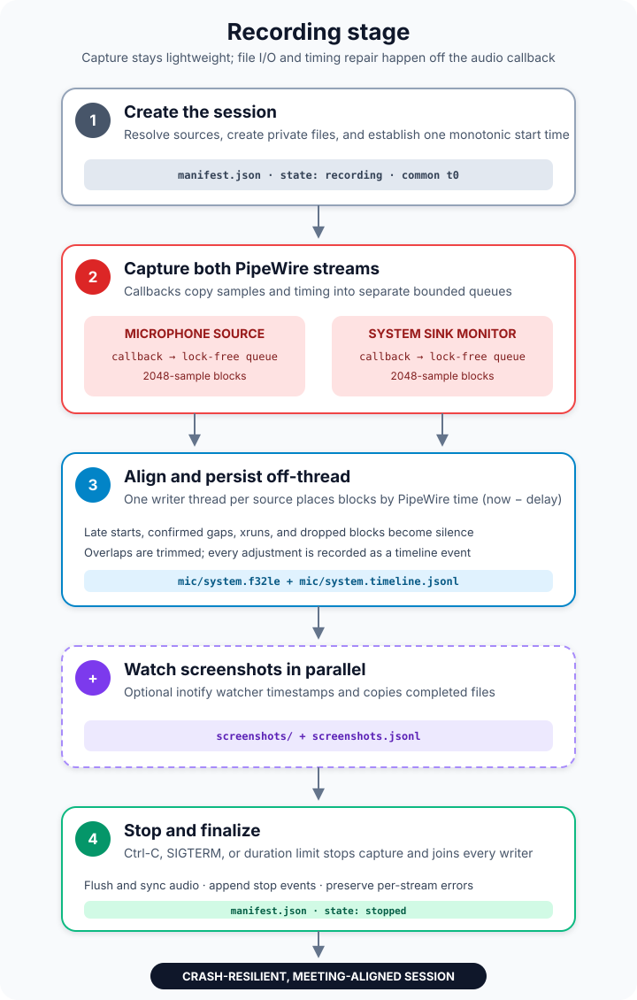
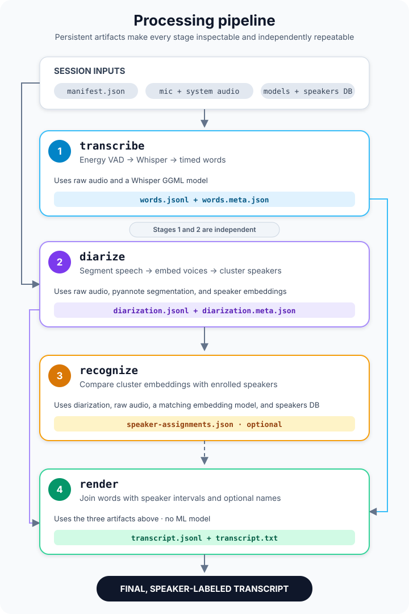

<div align="center">
  <h1>singstone</h1>
  <p>Local-only meeting recorder, transcriber and speaker diarizer for Linux and PipeWire.</p>

[](https://nsg.github.io/aibadge/#mostly)
</div>

## About

singstone records microphone and system audio on one meeting clock, optionally
files screenshots, then builds a timestamped, speaker-attributed transcript.
Capture, Whisper transcription, sherpa-onnx diarization, and voice recognition
all run locally. The binary contains no network code.


## Features

- Captures a microphone, a PipeWire sink monitor, or both as aligned 16 kHz mono
  `f32le` audio.
- Keeps filesystem work outside the real-time callback; fills gaps with silence
  and logs capture problems.
- Copies new screenshots into the session with meeting-relative timestamps.
- Transcribes with whisper.cpp and diarizes with pyannote segmentation plus
  speaker embeddings through sherpa-onnx.
- Matches diarized clusters to enrolled voices; uncertain matches remain
  anonymous.
- Verifies model size, purpose, and SHA-256 before loading native parsers.

## Quick start

This quick start targets Ubuntu 24.04 on x86-64 and requires Rust 1.88 or newer.
Use headphones when capturing both sources so remote speech does not leak into
the microphone track. The native inference libraries are not stored in Git;
from the repository root, fetch them before building:

```bash
sudo apt install bzip2 clang cmake curl jq libclang-dev libpipewire-0.3-dev libspa-0.2-dev pkg-config
scripts/fetch-sherpa-onnx.sh
cargo build --locked
export PATH="$PWD/target/debug:$PATH"
```

The fetch script creates the gitignored `third_party/` directory and a
`third_party/sherpa-onnx` symlink whose `lib/` directory is used by local
builds. Their absence in a fresh clone is expected. Keep them in place when
running `target/debug/singstone`. To install elsewhere, copy that binary plus
`third_party/sherpa-onnx/lib/libsherpa-onnx-c-api.so` and
`third_party/sherpa-onnx/lib/libonnxruntime.so` into one directory. Another
Ubuntu system also needs the `libpipewire-0.3-0` runtime package.

Download the models pinned by [`docs/models.lock`](docs/models.lock):

```bash
model_dir="${XDG_DATA_HOME:-$HOME/.local/share}/singstone/models"
config_dir="${XDG_CONFIG_HOME:-$HOME/.config}/singstone"
mkdir -p "$model_dir" "$config_dir"

curl -fL https://huggingface.co/ggerganov/whisper.cpp/resolve/5359861c739e955e79d9a303bcbc70fb988958b1/ggml-base.en.bin \
  -o "$model_dir/ggml-base.en.bin"
curl -fL https://github.com/k2-fsa/sherpa-onnx/releases/download/speaker-segmentation-models/sherpa-onnx-pyannote-segmentation-3-0.tar.bz2 \
  | tar -xj -C "$model_dir"
curl -fL https://github.com/k2-fsa/sherpa-onnx/releases/download/speaker-recongition-models/nemo_en_titanet_small.onnx \
  -o "$model_dir/nemo_en_titanet_small.onnx"
cp docs/models.lock "$config_dir/models.lock"
```

Record a meeting, stop with Ctrl-C, then process the session:

```bash
singstone devices
singstone record --mic default --system default \
  --screenshots ~/Pictures/Screenshots --local-speaker "Me"

model_dir="${XDG_DATA_HOME:-$HOME/.local/share}/singstone/models"
singstone process session-20260914-103000 \
  --whisper-model "$model_dir/ggml-base.en.bin" \
  --segmentation-model "$model_dir/sherpa-onnx-pyannote-segmentation-3-0/model.onnx" \
  --embedding-model "$model_dir/nemo_en_titanet_small.onnx"
```

The results are `SESSION/transcript.jsonl` for programs and
`SESSION/transcript.txt` for people.

## Configuration

Model paths and the speaker database accept flags or environment variables:

| Variable | Flag | Meaning |
|---|---|---|
| `SINGSTONE_WHISPER_MODEL` | `--whisper-model` | whisper.cpp GGML model |
| `SINGSTONE_SEGMENTATION_MODEL` | `--segmentation-model` | pyannote segmentation ONNX model |
| `SINGSTONE_EMBEDDING_MODEL` | `--embedding-model` | sherpa-onnx speaker embedding model |
| `SINGSTONE_MODELS_LOCK` | `--models-lock` | trusted model manifest; `$XDG_CONFIG_HOME/singstone/models.lock`, falling back to `~/.config/singstone/models.lock` |
| `SINGSTONE_SPEAKERS_DB` | `--speakers-db` | enrolled speakers; `$XDG_DATA_HOME/singstone/speakers.json`, falling back to `~/.local/share/singstone/speakers.json` |

Model-backed commands reject models whose purpose, size, and SHA-256 do not
match `models.lock`. A missing lock file is also an error. Use
`--allow-unverified-models` only when intentionally testing an unlisted model.
Add an entry to the configured copy with
`scripts/models-lock-add.sh FILE "${XDG_CONFIG_HOME:-$HOME/.config}/singstone/models.lock"`,
then review and complete its metadata before use.

## CLI

| Command | Purpose |
|---|---|
| `devices` | List selectable PipeWire sources and sinks |
| `record` | Capture audio and optional screenshots into a new session |
| `process` | Run all configured offline processing stages |
| `transcribe` | Produce word-level text and timestamps |
| `diarize` | Produce anonymous speaker intervals |
| `recognize` | Match speaker clusters to enrolled voices |
| `render` | Build final transcript files from intermediate artifacts |
| `enroll` | Add voice samples to the speaker database |
| `speakers` | List enrolled speakers |

Run `singstone COMMAND --help` for every flag. Device arguments accept
`default`, `none`, a PipeWire node ID, or a node name printed by `devices`.
System audio uses the selected sink's monitor.

### Recording



`record` creates a private session and a common monotonic start time. PipeWire
callbacks copy samples and timing into bounded queues; writer threads align and
append each audio track. Confirmed gaps and dropped blocks become silence so the
tracks stay synchronized, with every correction logged in `*.timeline.jsonl`.
The optional inotify watcher copies completed screenshots on the same clock.

Stop with Ctrl-C, SIGTERM, or `--duration`. One failed source does not stop a
healthy source. See [Recording](docs/recording.md) for timing, failure handling,
screenshot behavior, and the complete artifact contract.

### Processing



Use `process` for the normal one-command path. Use the split stages to inspect an
intermediate artifact or tune one model without repeating unrelated work:

```bash
singstone transcribe SESSION --whisper-model /path/to/whisper.bin
singstone diarize SESSION --segmentation-model /path/to/segmentation.onnx \
  --embedding-model /path/to/embedding.onnx
singstone recognize SESSION --embedding-model /path/to/embedding.onnx \
  --speakers-db /path/to/speakers.json
singstone render SESSION
```

| Stage | Contract |
|---|---|
| `transcribe` | Enabled audio → energy VAD → Whisper → `words.jsonl` + metadata |
| `diarize` | System audio and optional mic → pyannote segmentation, embeddings, clustering → `diarization.jsonl` + metadata |
| `recognize` | Diarization, source audio, and matching model/database → cosine comparison → `speaker-assignments.json` |
| `render` | Words, diarization, and optional current assignments → `transcript.jsonl` and `transcript.txt`; no model |

`--cluster-threshold` controls cluster merging; lower values usually produce
more speakers. `--speaker-threshold` controls how confident a voice match must
be. The microphone uses `--local-speaker` unless `--diarize-mic` is enabled.

| Problem | Rerun |
|---|---|
| Incorrect words or language | `transcribe`, `render` |
| Incorrect speaker boundaries or count | `diarize`, `recognize`, `render` |
| Correct clusters but incorrect names | `recognize`, `render` |
| Manually edited words | `render` |
| Several people share the microphone | `diarize --diarize-mic`, `recognize`, `render` |

Keep these boundaries in mind:

- Stop recording before processing. `transcribe` and `diarize` may run in
  parallel; same-stage writers and downstream/upstream overlap are unsupported.
- Standalone stages preserve the previous output when a required input fails.
  `process` may skip missing enabled audio and recover from diarization or
  recognition failures, so a partial run can replace tuned artifacts.
- Metadata hashes warn when audio or intermediate files change. If assignments
  refer to different diarization, `render` discards all stored names.
- Enrollment samples must be at least two seconds of 16 kHz mono WAV or raw
  `f32le`. Recognition requires the enrolled model's exact SHA-256 and embedding
  dimension.

See [Processing stages](docs/processing.md) for the VAD and chunking algorithm,
model roles, clustering and recognition details, artifact schemas, provenance,
and render rules.

### Session artifacts

| Path | Purpose |
|---|---|
| `manifest.json` | Session state, clock, format, sources, and local speaker |
| `audio/*.f32le` | Meeting-aligned raw audio |
| `audio/*.timeline.jsonl` | Capture timing and error diagnostics |
| `screenshots/`, `screenshots.jsonl` | Timestamped screenshot copies and index |
| `words.jsonl`, `words.meta.json` | Timed transcription and provenance |
| `diarization.jsonl`, `diarization.meta.json` | Speaker intervals and provenance |
| `speaker-assignments.json` | Optional recognized names and provenance |
| `transcript.jsonl`, `transcript.txt` | Final machine-readable and text transcripts |

All meeting-relative timestamps are milliseconds from the meeting start. With
ffmpeg installed, convert raw audio when another tool needs WAV:

```bash
ffmpeg -f f32le -ar 16000 -ac 1 -i SESSION/audio/system.f32le system.wav
```

## Development

```bash
sudo apt install pipewire pipewire-bin wireplumber pipewire-audio-client-libraries
cargo install --locked cargo-audit cargo-deny

cargo fmt && cargo clippy --all-targets -- -D warnings && cargo test
source scripts/pw-headless.sh
SINGSTONE_PW_TEST=1 cargo test --test record_pipewire -- --test-threads=1
SINGSTONE_TEST_MODELS=/path/to/models SINGSTONE_TEST_SAMPLES=/path/to/samples \
  cargo test --test process_ami
cargo audit && cargo deny check
```

Optional Cargo features `vulkan`, `intel-sycl`, and `openblas` accelerate
whisper.cpp. Diarization runs on CPU. CI also creates a temporary dependency
snapshot and verifies an offline build.

## Documentation

- [Recording internals](docs/recording.md)
- [Processing stages](docs/processing.md)
- [Dependency review and supply-chain policy](docs/dependencies.md)
- [Original design specification](docs/design-spec.md)

## License

MIT OR Apache-2.0
