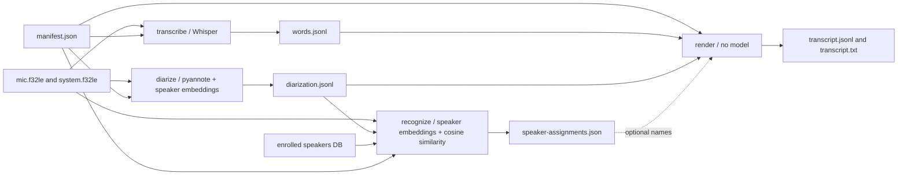

<div align="center">
  <h1>singstone</h1>
  <p>Local-only meeting recorder, transcriber and speaker diarizer for Linux and PipeWire.</p>

[](https://nsg.github.io/aibadge/#mostly)
</div>

## About

singstone records a meeting from two PipeWire sources at once, the microphone
and the system audio (what you hear from the remote participants), and later
turns the recording into a timestamped, speaker-attributed transcript. Every
step runs on your machine: capture, whisper.cpp transcription, sherpa-onnx
diarization and optional recognition of enrolled voices. The binary contains
no network code.

Recording and processing are separate. Recording writes append-only raw PCM
plus timing metadata and survives crashes; processing is an offline,
idempotent step that can be re-run with different models or thresholds. The
outputs (`transcript.jsonl`, `screenshots.jsonl`, copied screenshots) are
meant to feed a separate summarization pipeline. Summaries, LLMs, OCR and a
GUI are deliberately out of scope.

## Features

- Records microphone, system audio (sink monitor) or both, as 16 kHz mono
  `f32le` files that share one meeting clock (`sample / 16000` = meeting time).
- Real-time safe capture: the PipeWire callback only copies into a lock-free
  queue; gaps and drops are filled with silence and logged, never hidden.
- Watches your screenshot directory (inotify) and files each new screenshot
  under its meeting timestamp.
- Word-level transcription with whisper.cpp, energy-based voice activity
  detection to keep whisper away from silence.
- Speaker diarization of the remote track with sherpa-onnx (pyannote
  segmentation + speaker embeddings); the mic track is attributed to you
  unless `--diarize-mic`.
- Enroll known voices once; later recordings name them when the match is
  confident, otherwise speakers stay `SPEAKER_NN`.
- Supply-chain policy: pinned native libraries with verified hashes,
  SHA-256-locked model files, `cargo audit`/`deny`/`vet`, offline builds.

## Quick start

Ubuntu 24.04, PipeWire, Rust stable. Headphones are strongly recommended when
recording both sources; otherwise the mic hears the speakers and remote
speech appears in both tracks.

```bash
# build dependencies
sudo apt install cmake clang libclang-dev libpipewire-0.3-dev libspa-0.2-dev pkg-config

# verified sherpa-onnx native libraries (only network step of the build)
scripts/fetch-sherpa-onnx.sh
cargo build
# the binary loads libsherpa-onnx-c-api.so / libonnxruntime.so from
# third_party/sherpa-onnx/lib or from its own directory ($ORIGIN); when
# installing, copy those two files next to the binary.

# models (not downloaded by singstone; see docs/models.lock for hashes)
mkdir -p ~/.local/share/singstone/models && cd ~/.local/share/singstone/models
curl -LO https://huggingface.co/ggerganov/whisper.cpp/resolve/main/ggml-base.en.bin
curl -LO https://github.com/k2-fsa/sherpa-onnx/releases/download/speaker-segmentation-models/sherpa-onnx-pyannote-segmentation-3-0.tar.bz2
tar xjf sherpa-onnx-pyannote-segmentation-3-0.tar.bz2
curl -LO https://github.com/k2-fsa/sherpa-onnx/releases/download/speaker-recongition-models/nemo_en_titanet_small.onnx
mkdir -p ~/.config/singstone && cp /path/to/singstone/docs/models.lock ~/.config/singstone/
```

Record, then process:

```bash
singstone devices
singstone record --mic default --system default \
    --screenshots ~/Pictures/Screenshots --local-speaker "Me"
# ... meeting ... Ctrl-C

singstone process session-20260914-103000 \
    --whisper-model ~/.local/share/singstone/models/ggml-base.en.bin \
    --segmentation-model ~/.local/share/singstone/models/sherpa-onnx-pyannote-segmentation-3-0/model.onnx \
    --embedding-model ~/.local/share/singstone/models/nemo_en_titanet_small.onnx
```

## Configuration

Model paths and the speaker database can be given as flags or environment
variables:

| Variable | Flag | Meaning |
|---|---|---|
| `SINGSTONE_WHISPER_MODEL` | `--whisper-model` | whisper.cpp GGML model |
| `SINGSTONE_SEGMENTATION_MODEL` | `--segmentation-model` | sherpa-onnx pyannote segmentation `model.onnx` |
| `SINGSTONE_EMBEDDING_MODEL` | `--embedding-model` | sherpa-onnx speaker embedding model |
| `SINGSTONE_MODELS_LOCK` | `--models-lock` | trusted model manifest; default `$XDG_CONFIG_HOME/singstone/models.lock` |
| `SINGSTONE_SPEAKERS_DB` | `--speakers-db` | enrolled speakers; default `$XDG_DATA_HOME/singstone/speakers.json` |

Models are treated as untrusted input to native parsers: processing commands and
`enroll` refuse a model whose SHA-256 is not in `models.lock` unless
`--allow-unverified-models` is passed. Each entry also carries a `purpose`
(`transcription`, `diarization-segmentation` or `speaker-embedding`) and the
file size, both checked against the role the model is used for.
`scripts/models-lock-add.sh FILE` appends a skeleton entry for a new model.

Optional Cargo features: `vulkan`, `intel-sycl`, `openblas` (whisper.cpp
acceleration, CPU is the default). Diarization runs on CPU.

## CLI

```text
singstone devices                     list PipeWire sources and sinks
singstone record [--mic X] [--system Y] [--screenshots DIR]
                 [--local-speaker NAME] [--output-dir DIR] [--duration SECS]
singstone process SESSION [--diarize-mic] [--no-diarize] [--skip-transcription]
                 [--language en] [--threads N] [--speaker-threshold 0.6]
                 [--cluster-threshold 1.0] [--num-speakers N]
singstone transcribe SESSION --whisper-model MODEL [--language en] [--threads N]
singstone diarize SESSION --segmentation-model MODEL --embedding-model MODEL
                 [--diarize-mic] [--cluster-threshold 1.0] [--num-speakers N]
                 [--threads N]
singstone recognize SESSION --embedding-model MODEL
                 [--speakers-db FILE] [--speaker-threshold 0.6] [--threads N]
singstone render SESSION [--diarize-mic[=BOOL]]
singstone enroll NAME SAMPLE... [--replace]      samples: 16 kHz mono WAV or raw f32le
singstone speakers
```

Device arguments accept `default`, `none`, a PipeWire node id or a node name
as printed by `devices`. System audio captures the selected sink's monitor.

`process` is idempotent and rewrites its outputs atomically. Use
`--skip-transcription` to reuse an existing `words.jsonl` while re-running
diarization or speaker recognition with different thresholds (the whisper
model is then not needed); whisper is by far the slowest stage. Diarization
and speaker-recognition failures degrade to anonymous or `unknown` speakers
instead of aborting. `--cluster-threshold` controls how eagerly diarized
segments are merged into speakers (lower = more speakers); 0.9 to 1.1 gave
the best results with the titanet-small embedding model on a 4-speaker AMI
meeting (the 4 real speakers came out with 75-87 % purity, split over about
a dozen clusters). `--speaker-threshold` is the minimum cosine similarity for naming a
cluster after an enrolled speaker; unmatched clusters stay `SPEAKER_NN`.

For debugging or tuning, run the same pipeline as separate commands:

```bash
singstone transcribe SESSION --whisper-model /path/to/whisper.bin
singstone diarize SESSION --segmentation-model /path/to/segmentation.onnx \
    --embedding-model /path/to/embedding.onnx
# Optional: name clusters from an enrolled-speaker database.
singstone recognize SESSION --embedding-model /path/to/embedding.onnx \
    --speakers-db /path/to/speakers.json
singstone render SESSION
```

Each command reads its required session artifacts and replaces each output file
atomically. A primary artifact and its metadata sidecar are separate file
replacements rather than one transaction. `render` also works when
`speaker-assignments.json` is absent, leaving diarized speakers anonymous; a
present but invalid assignment file is an error. `process` remains the
convenience command that runs the complete pipeline.
`render` normally inherits the microphone policy from `diarization.meta.json`;
use `--diarize-mic` or `--diarize-mic=false` only to make the policy explicit.
Standalone stages fail without replacing a prior good artifact when a required
model, audio track or upstream artifact is unavailable.

### Processing pipeline

The split commands expose the same work performed by `process`. They are useful
when one result looks wrong, because each intermediate artifact can be inspected
and regenerated without rerunning unrelated models.



`transcribe` and `diarize` are independent: neither consumes the other's
output. `recognize` needs diarization, while `render` needs transcription and
diarization and can use recognition when it is available. All timestamps remain
relative to the meeting clock established by `record`.

Before a model-backed stage starts, singstone checks the model's file size,
SHA-256 digest and declared purpose against `models.lock`. `--allow-unverified-models`
can explicitly relax that check. Standalone commands generally treat a missing
enabled audio track, model or required upstream artifact as an error, retaining
the existing output. Empty enabled audio and empty diarization are valid empty
inputs, however, and recognition of empty diarization needs no model or speaker
database. The aggregate `process` command keeps its recovery-oriented behavior:
diarization and recognition failures become warnings so a transcript can still
be produced with anonymous or `unknown` speakers. Because it writes the same
artifacts, such degraded results can replace outputs from earlier tuned stage
runs.

#### 1. Transcribe: audio to timed words

```bash
singstone transcribe SESSION \
    --whisper-model ~/.local/share/singstone/models/ggml-base.en.bin \
    --language en --threads 8
```

**Input:** `manifest.json`, every enabled `audio/*.f32le` track, and a
whisper.cpp GGML model. The audio must be 16 kHz mono float PCM, as produced by
`record`.

**Model:** Whisper, through `whisper-rs`. The documented example uses
`ggml-base.en.bin`, but any compatible, correctly locked whisper.cpp GGML model
can be supplied. `--language auto` enables language detection; otherwise the
given language code is passed to Whisper. The same loaded model and inference
state are reused for the microphone and system tracks.
Use a multilingual Whisper model for non-English languages or automatic
language detection; the example `base.en` model is English-only. Each enabled
raw track is read into memory before its transcription pass.

The stage performs these operations:

1. It runs an energy-based voice activity detector over 20 ms frames. A frame
   above -45 dBFS is considered speech. The detector keeps 200 ms of hangover,
   rejects raw speech bursts shorter than 250 ms, merges retained regions
   separated by at most 500 ms, and pads them by 300 ms. This detector is signal
   processing and uses no model.
2. Speech regions longer than 25 minutes are split at the quietest 20 ms frame
   within 30 seconds of the target boundary. Regions shorter than one second
   are widened into the surrounding source audio. Only a final inference chunk
   that is still shorter than one second is padded with zero samples, because
   Whisper needs enough samples to process it reliably.
3. Retained audio is passed to Whisper in chunks of at most 30 seconds. The
   decoder uses greedy sampling, token timestamps, no previous-text context and
   the configured thread count.
4. Tokens are grouped at whitespace boundaries, with punctuation attached to
   its word, and timestamps are converted back to meeting-relative
   milliseconds. Empty tokens, bracketed annotations such as `[music]`,
   parenthesized annotations and music-note-only output are removed. Words that
   do not touch a retained VAD region are dropped. Timestamps are clamped to the
   source chunk and made non-overlapping so words do not run backward.
5. Words from both sources are sorted by start time, with microphone words first
   on an exact tie, and written atomically.

The main output is one JSON object per line in `words.jsonl`:

```json
{"source":"system","start_ms":10120,"end_ms":10480,"text":"We"}
```

`words.meta.json` records the format version, output hash, hashes of the audio
tracks that were used, Whisper model hash, language and effective thread count.
`render` checks the recorded hashes and warns if the audio or word file changed
after transcription. Deliberate manual edits remain usable; the warning makes
the provenance mismatch visible.

```json
{
  "format_version": 1,
  "output_file": "words.jsonl",
  "output_sha256": "...",
  "mic_audio_sha256": "...",
  "system_audio_sha256": "...",
  "whisper_model_sha256": "...",
  "language": "en",
  "threads": 8
}
```

Disabled or unavailable input tracks have a `null` audio hash. The metadata
does not include the executable version or the fixed VAD settings, so treat it
as a staleness check rather than a complete recipe for reproducing inference.

Use this boundary when text or word timing is wrong. Change the Whisper model or
language and rerun only `transcribe`; diarization and recognition do not need to
run again unless their own inputs changed.

#### 2. Diarize: audio to anonymous speaker intervals

```bash
singstone diarize SESSION \
    --segmentation-model ~/.local/share/singstone/models/sherpa-onnx-pyannote-segmentation-3-0/model.onnx \
    --embedding-model ~/.local/share/singstone/models/nemo_en_titanet_small.onnx \
    --cluster-threshold 1.0
```

**Input:** `manifest.json`, the system audio track, and two ONNX models. The
microphone track is also processed when `--diarize-mic` is supplied.
`words.jsonl` is not an input, so this stage can run before or in parallel with
transcription.

**Models:** sherpa-onnx runs a pyannote speaker-segmentation model and a speaker
embedding model. The segmentation model finds speaker-homogeneous time ranges;
the embedding model represents the voice in each range as a numeric vector.
Fast agglomerative clustering groups similar vectors under numeric cluster IDs.
Both models run on CPU.

Each source is diarized independently, so microphone cluster `0` and system
cluster `0` describe unrelated voices. `--cluster-threshold` controls how
readily clusters are combined. Lower values usually produce more speakers;
values around 0.9 to 1.1 have worked best with
the documented TitaNet model on the tested AMI sample. `--num-speakers N`
replaces automatic speaker-count estimation with that fixed count separately
for each enabled source. Cluster numbers are local implementation labels, not
persistent identities: cluster `2` from one diarization run need not represent
cluster `2` after changing a model or threshold.

The result is sorted by meeting time and written to `diarization.jsonl`:

```json
{"source":"system","start_ms":12000,"end_ms":18300,"cluster":0}
```

Segment timestamps are converted to integer milliseconds and clamped to the
available audio. `diarization.meta.json` records both model hashes, relevant
settings, effective thread count, input audio hashes and the output hash. It
also records whether microphone diarization was enabled, allowing `render` to
inherit that policy automatically.

```json
{
  "format_version": 1,
  "output_file": "diarization.jsonl",
  "output_sha256": "...",
  "mic_audio_sha256": null,
  "system_audio_sha256": "...",
  "segmentation_model_sha256": "...",
  "embedding_model_sha256": "...",
  "diarize_mic": false,
  "cluster_threshold": 1.0,
  "num_speakers": null,
  "threads": 8
}
```

Use this boundary when speaker changes or cluster counts look wrong. Rerun
`diarize` with a different threshold or fixed speaker count, inspect the JSONL,
then rerun `recognize` because new diarization can renumber or regroup clusters.
Stale recognition assignments are detected by hash and ignored.

#### 3. Recognize: anonymous clusters to enrolled names

Speaker recognition is optional. Without it, `render` assigns anonymous display
names such as `SPEAKER_00`. These names are deterministic for one fixed set of
diarization segments and assignments, but their numbers can change after either
artifact changes. Use `speaker_id`, such as `spk_3` or `mic_1`, to identify the
underlying source and cluster in a particular diarization result.

```bash
singstone recognize SESSION \
    --embedding-model ~/.local/share/singstone/models/nemo_en_titanet_small.onnx \
    --speakers-db ~/.local/share/singstone/speakers.json \
    --speaker-threshold 0.6
```

**Input:** `diarization.jsonl`, the referenced raw audio tracks, a sherpa-onnx
speaker embedding model, and a database created by `singstone enroll`. The
model's exact SHA-256 digest and embedding dimension must match those recorded
when the database was enrolled.

**Model:** any compatible sherpa-onnx speaker embedding model that matches the
enrollment database. It will usually be the model used for diarization, and the
documented model is NeMo TitaNet Small, but diarization and recognition do not
require the same model. Recognition does not run the segmentation model and
does not transcribe speech.

For every distinct `(source, cluster)` pair, the stage:

1. Selects diarized intervals at least 1.5 seconds long, longest first, up to
   30 seconds of speech per cluster. If the last selected interval would exceed
   that budget, it is cut to the remaining duration.
2. Computes a normalized embedding for each selected interval, gives each
   interval equal weight when averaging the embeddings, and normalizes the
   result again.
3. Computes cosine similarity against every enrolled embedding. The highest
   score becomes `best_candidate`.
4. Assigns that candidate's name only when the score is at least
   `--speaker-threshold`. A lower threshold names more clusters but raises the
   chance of a false match. The default is `0.6`.

The versioned `speaker-assignments.json` contains every diarized cluster, even
when it has no usable embedding or confident match:

```json
{
  "format_version": 1,
  "provenance": {
    "diarization_file": "diarization.jsonl",
    "diarization_sha256": "...",
    "embedding_model_sha256": "...",
    "speakers_database_sha256": "...",
    "speaker_threshold": 0.6
  },
  "assignments": [
    {
      "source": "system",
      "cluster": 0,
      "best_candidate": "Alice",
      "score": 0.82,
      "speaker": "Alice"
    }
  ]
}
```

`best_candidate` and `score` remain present below the threshold, while
`speaker` is omitted. This makes threshold problems distinguishable from
embedding failures. Recognition is performed separately for the microphone and
system sources, and the same enrolled name may legitimately match more than one
cluster.

Use this boundary when diarization looks correct but names do not. Adjust
`--speaker-threshold`, add enrollment samples, or inspect the candidate scores,
then rerun only `recognize` and `render`. If `diarization.jsonl` no longer
matches the hash stored in the assignment file, `render` ignores all stored
names rather than risk assigning a name to a newly renumbered cluster.

#### 4. Render: intermediate artifacts to the final transcript

```bash
singstone render SESSION
```

**Input:** `manifest.json`, `words.jsonl`, `diarization.jsonl`, their metadata
sidecars when present, and optionally `speaker-assignments.json`. Missing
assignment data is allowed, but malformed or unsupported assignment metadata or
diarization metadata is an error. This stage uses no ML model and is fast.

For each word, `render` considers only diarization segments from the same audio
source. It chooses the cluster with the greatest timestamp overlap. When there
is no overlap, it can use the nearest segment within 500 ms; otherwise the word
is assigned to `unknown`.

Microphone words normally bypass diarization and use the local speaker name from
`manifest.json`, with speaker ID `local`. If the diarization stage included the
microphone, `render` reads that choice from `diarization.meta.json`; microphone
words then use microphone cluster IDs and recognized or anonymous names instead
of the manifest's local name. A word with no overlapping or nearby microphone
segment becomes `unknown`. For legacy sessions without metadata, `render`
infers the choice from the presence of microphone segments.
`--diarize-mic` and `--diarize-mic=false` provide explicit overrides; an
override that conflicts with current metadata is rejected instead of silently
changing speaker attribution.

Unrecognized clusters receive `SPEAKER_NN` display names in first-seen segment
order. `NN` is a display counter rather than the cluster number. Recognized
names replace only the display name; the source and numeric cluster remain
visible through IDs such as `spk_3` or `mic_1`.

Adjacent words are grouped into utterances. A new utterance starts when the
speaker changes, the silence between words exceeds one second, or an utterance
has reached 15 seconds and ends with sentence punctuation. Whitespace and
punctuation spacing are normalized, and utterances from both sources are sorted
on the common meeting timeline.

The stage replaces the canonical `transcript.jsonl` and readable
`transcript.txt` atomically one file at a time:

```json
{"start_ms":12340,"end_ms":15780,"source":"system","speaker_id":"spk_0","speaker":"Alice","text":"I think we should ship it on Friday."}
```

```text
[00:00:12.340] Alice: I think we should ship it on Friday.
```

Before rendering, singstone compares the available provenance hashes with the
current intermediate files and audio. Edited or replaced word and diarization
artifacts produce warnings but remain renderable. Speaker assignments are
treated more strictly: if their recorded diarization path or hash does not
match, all stored names are discarded and clusters remain anonymous. This
staleness check does not compare the current enrollment database, embedding
model or recognition threshold; rerun `recognize` yourself after changing any
of those inputs.

Use this boundary after manually correcting `words.jsonl`, editing only the
`speaker` values in an existing assignment file, or experimenting with
presentation logic. Changes to the enrollment database, embedding model or
threshold require `recognize` first. Rendering itself loads no model.

#### Rerun recipes

| Problem or goal | Commands to rerun |
|---|---|
| Incorrect words or language | `transcribe`, then `render` |
| Too many or too few speaker clusters | `diarize`, `recognize`, then `render` |
| Correct clusters but incorrect names | `recognize`, then `render` |
| Manually edited words | `render` |
| Manually edited speaker segments | `recognize`, then `render`; or only `render` for anonymous names |
| Anonymous transcript with no enrollment database | Skip `recognize`; run `render` |
| Several people share the local microphone | `diarize --diarize-mic`, `recognize`, then `render` |

`process` runs the same stage algorithms in recovery mode and remains the normal
one-command path. A missing or failed optional diarization or recognition input
can therefore produce an empty or partial artifact and replace a tuned result.
Use the split commands when preserving the last successful stage output matters,
when model inference is slow, or when one stage needs repeated tuning.

The VAD thresholds and chunk sizes described above are currently fixed. Whisper
chunks do not overlap and do not share text context, so transcription quality
can degrade at a 30-second boundary. Stop `record` before processing its session.
`transcribe` and `diarize` may run concurrently because they write disjoint
artifacts. Concurrent runs of the same stage, or a downstream stage while its
upstream artifact is still being written, are unsupported.

### Session layout

```text
session-20260914-103000/
├── manifest.json            state, start time, format, sources, local speaker
├── audio/mic.f32le          16 kHz mono float PCM, meeting-aligned
├── audio/mic.timeline.jsonl start/xrun/dropped/overlap/clock_jump/stop events
├── audio/system.f32le
├── audio/system.timeline.jsonl
├── screenshots/000123456-Shot.png
├── screenshots.jsonl        {"time_ms":123456,"file":"screenshots/...","original":"/home/..."}
├── words.jsonl              {"source":"system","start_ms":10120,"end_ms":10480,"text":"We"}
├── words.meta.json          transcription model, settings and input/output hashes
├── diarization.jsonl        {"source":"system","start_ms":12000,"end_ms":18300,"cluster":0}
├── diarization.meta.json    diarization models, settings and input/output hashes
├── speaker-assignments.json recognized names and recognition provenance
├── transcript.jsonl         canonical output, see below
└── transcript.txt           [00:00:12.340] Alice: I think we should ship it on Friday.
```

If diarization changes after recognition, `render` ignores the stale speaker
assignments and uses anonymous names until `recognize` is run again.

`transcript.jsonl` lines:

```json
{"start_ms":12340,"end_ms":15780,"source":"system","speaker_id":"spk_0","speaker":"Alice","text":"I think we should ship it on Friday."}
{"start_ms":15920,"end_ms":17620,"source":"mic","speaker_id":"local","speaker":"Me","text":"That works for me."}
```

Convert a track to WAV with ffmpeg if needed:
`ffmpeg -f f32le -ar 16000 -ac 1 -i audio/system.f32le system.wav`.

### Timing model

Both audio files start at the same meeting instant (the monotonic clock
when `record` started). Each captured block is placed by PipeWire's own
stream time (`now - delay`); late stream start, xruns and queue overruns are
filled with silence and logged in the per-stream timeline, so a crashed or
interrupted recording still lines up. Gap insertion needs confirmation by
the following block, is capped at 60 s per block, and a capped gap is
logged as `clock_jump`. Session names and `started_wallclock` use the local
time zone read from `/etc/localtime`, falling back to UTC.

The headless test harness (`scripts/pw-headless.sh`) feeds the virtual mic
through a `pw-loopback`, which by itself introduces about 20 ms between the
two paths; the integration test allows 50 ms. Verify alignment on real
hardware before relying on it for cross-talk analysis.

## Development

```bash
# extra packages for the PipeWire integration tests (headless daemon)
sudo apt install pipewire pipewire-bin wireplumber pipewire-audio-client-libraries
cargo install --locked cargo-audit cargo-deny cargo-vet

cargo fmt && cargo clippy --all-targets -- -D warnings && cargo test
source scripts/pw-headless.sh                    # headless PipeWire with test-sink / test-mic
SINGSTONE_PW_TEST=1 cargo test --test record_pipewire -- --test-threads=1
SINGSTONE_TEST_MODELS=... SINGSTONE_TEST_SAMPLES=... cargo test --test process_ami
cargo audit && cargo deny check && cargo vet
```

`docs/design-spec.md` is the original design document, `docs/dependencies.md`
the dependency review and supply-chain policy.

## License

MIT OR Apache-2.0
