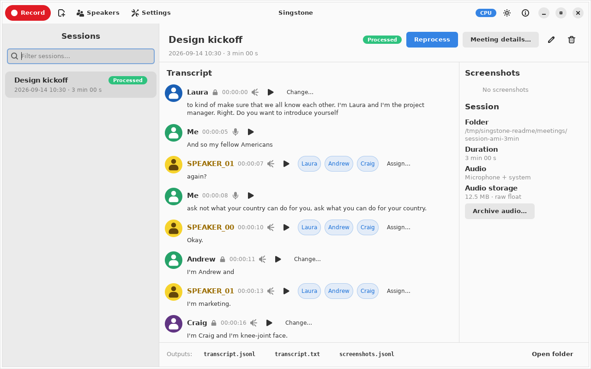
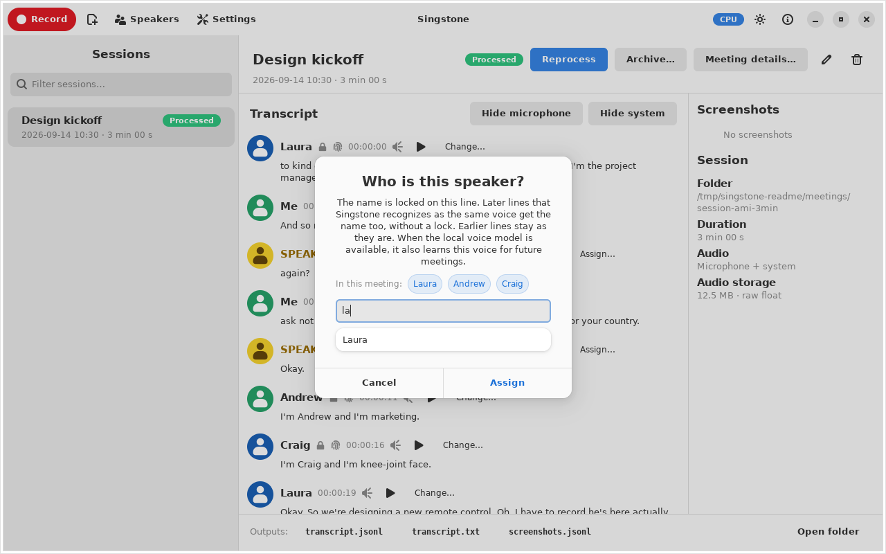
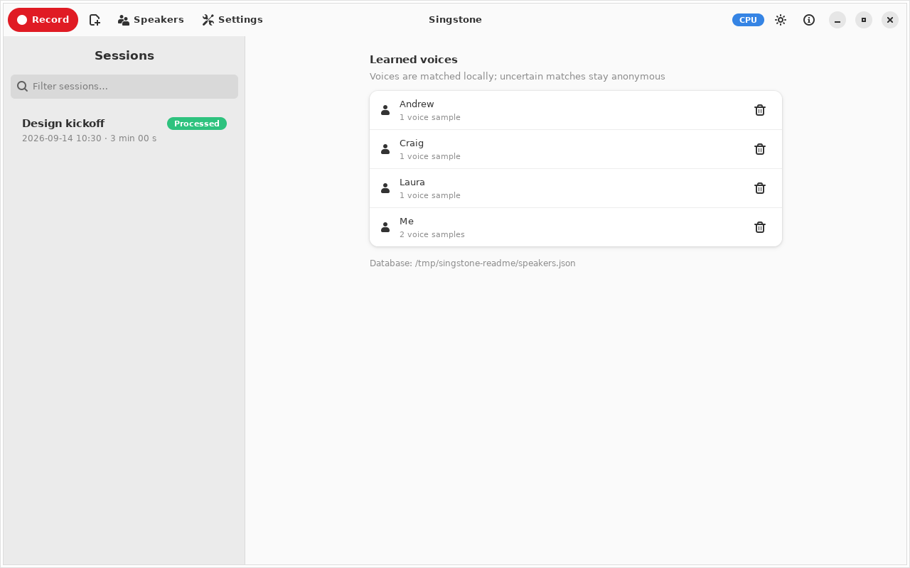
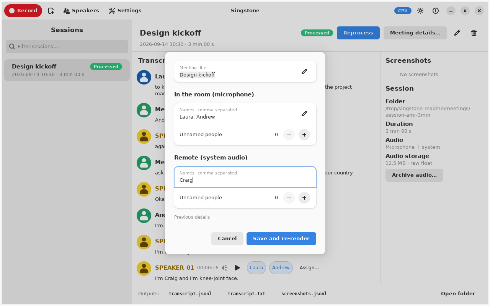
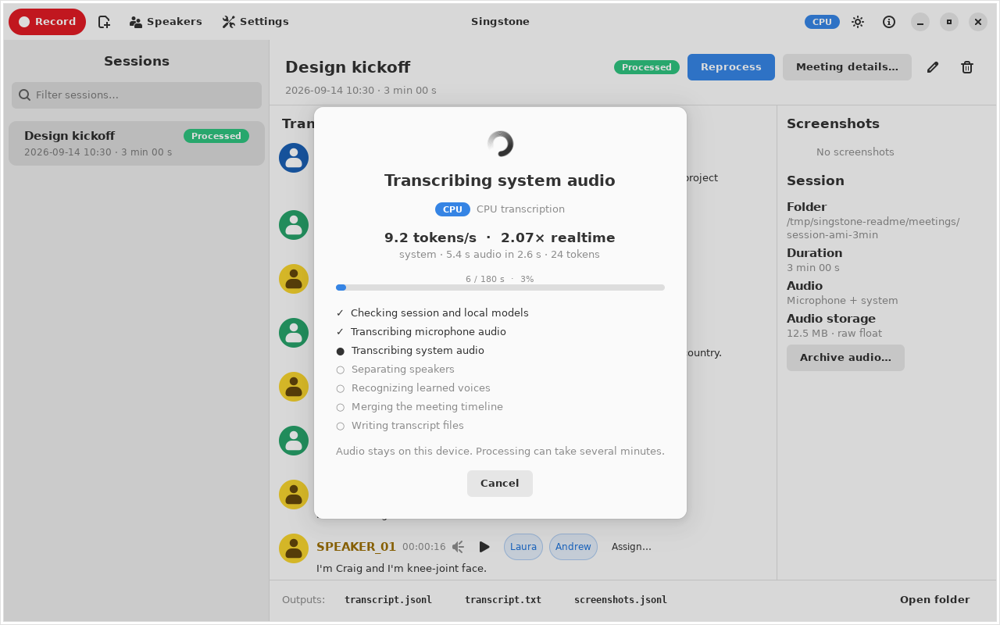

<div align="center">
  <h1>singstone</h1>
  <p>Local meeting recording, transcription, and speaker diarization for Linux and PipeWire.</p>

[](https://nsg.github.io/aibadge/#vibe)
</div>

## About

Singstone records microphone and system audio on one clock, optionally collects
screenshots, and produces a timestamped, speaker-attributed transcript. Recording
and machine-learning inference run locally.

The supported distribution is a strictly confined core24 Snap for AMD64 Linux.
It contains the application and source-built native runtimes. Model
weights download on first use and remain in a persistent per-user cache.

## Application

Browse processed meetings and review speaker-attributed transcripts from the
session view. Confirm individual names so they stay locked across reprocessing,
use quick speaker shortcuts on anonymous lines, or change a named line.
Use **Hide microphone** or **Hide system** to leave that source out of
both transcript files without deleting anything. Hiding the microphone is
useful when you only listened and it recorded nothing but leaked speaker audio.



Type a speaker name to filter learned voices and names already used in the
meeting, then choose a suggestion or assign a new name.



Naming a line locks that line and also names the later lines that Singstone
recognizes as the same voice. Those later lines stay unlocked, so a later
choice can rename them. Earlier lines are never changed. A lock icon marks a
line you named, and a fingerprint icon marks a line whose voice was learned.

Open Speakers to inspect the locally learned voices and the number of voice
samples stored for each person.



Use Meeting details… to title the meeting and place attendees in the room or on
the remote end before re-rendering the transcript.



Run the local processing pipeline without leaving the meeting window. The
dialog reports each stage and can be cancelled while work is in progress.
Reprocessing replaces derived outputs and automatic speaker matches while
preserving the recorded audio and confirmed names.



## Features

- Records a microphone, a PipeWire sink monitor, or both as aligned 16 kHz audio.
- Files screenshots against the same meeting clock.
- Transcribes with Whisper and separates speakers with pyannote and TitaNet.
- Automatically accelerates Whisper with Intel SYCL on a compatible Intel GPU,
  preferring Level Zero and retrying through OpenCL before using CPU.
- Recognizes learned voices while leaving uncertain matches anonymous.
- Uses per-meeting attendee details to guide speaker counts and recognition,
  while audio matching marks loudspeaker sound picked up by the microphone.
- Hides either audio source from a session's transcript without deleting it.
- Provides a native GTK interface with live capture meters, screenshot counts,
  per-stage processing progress, transcript-side audio playback, editable
  storage folders, and a one-click header Record button.
- Names speakers from the transcript: one-click shortcuts for people already
  in the meeting, and line-specific correction when a voice was matched to the
  wrong person. Confirmed lines remain locked across reprocessing.
- Renames sessions and deletes them, after a confirmation, from the session view.
- Archives a processed session's audio as 16-bit FLAC, about a fifth of the
  size, while keeping playback and reprocessing.
- Optional GNOME Shell extension with a top-bar Record/Stop button and live
  level meters.
- Learns fixed-window voice embeddings when a transcript line is named or
  corrected, building a local speaker database from confirmed speech.
- Keeps recording and inference offline under Snap confinement.
- Verifies every model's size, purpose, and SHA-256 before native code loads it.

## Quick start

Requirements:

- AMD64 Linux
- snapd 2.68 or newer
- PipeWire

The Snap is tuned for the Intel Iris Xe GPU in the Core i7-1185G7 and supports
the Intel GPU families covered by oneAPI 2026: 11th-generation Intel Core
integrated graphics and newer, Iris Xe, Arc, and Intel data-center GPUs. It
probes Level Zero at every launch, retries through Intel OpenCL if Level Zero
fails, and otherwise uses the existing CPU build. Older integrated GPUs can
pass a trivial SYCL kernel and still fail during Whisper inference, so the
launcher rejects them before selecting the GPU executable. Set
`SINGSTONE_DISABLE_GPU=1` to force the CPU path for diagnosis.
Swedish transcription uses KBLab's Swedish-tuned Whisper Small Q5_0 model and
sets the Whisper language to `sv` by default. A persistent, default-on Swedish
toggle in Settings switches to the multilingual OpenAI Whisper Small Q5_1
model with automatic language detection when turned off.
The probe writes its last completed stage and exit status to
`~/snap/singstone/common/gpu-probe.log`; when GPU startup fails, the CPU
indicator also shows the fallback reason.

Download the `.snap` directly from the rolling
[Latest release](https://github.com/nsg/singstone/releases/latest), then install
the unsigned build:

```bash
curl -fLO https://github.com/nsg/singstone/releases/latest/download/singstone_amd64.snap
sudo snap set system experimental.user-daemons=true
sudo snap install --dangerous ./singstone_amd64.snap
sudo snap connect singstone:opengl
sudo snap connect singstone:pipewire
```

The release is replaced after every successful `main` build; there are no
versioned releases. The package is not currently published in the Snap Store.
`--dangerous` tells snapd to accept the unsigned file; strict confinement still
applies. The snapd user-daemon feature is required for the per-user model setup
service.

Launch Singstone from the desktop application menu, or run it directly:

```bash
singstone
```

The GTK4 interface records meetings, browses existing sessions, displays
transcripts and timestamped screenshots, manages the local speaker list, and
runs the offline processing pipeline. The command-line interface remains
available for scripting and advanced processing.

### GNOME top bar control

The optional GNOME Shell extension adds a Record/Stop button and live audio
level meters to the top bar; Singstone must be installed and is launched
automatically when needed.
The panel polls the recorder status over D-Bus, so it does not depend on
session-bus signals reaching GNOME Shell.
The extension supports GNOME Shell 45 through 49.

Click the Record button to open its menu and start or stop a recording. An
update icon appears when a newer build is available; use **Update Singstone
and extension** to install both. It opens a terminal that downloads the snap
and the extension, closes Singstone if it is running (stop any recording
first), installs both after the `sudo` password prompt, and reopens Singstone.
Log out and back in to load the new extension. Update checks query the GitHub
API at most every six hours, plus when the menu is opened after 15 minutes.
Nothing is installed without clicking the update action.

Install the extension, then log out and back in (Wayland cannot load a new
extension into a running session):

```bash
curl -fLO https://github.com/nsg/singstone/releases/latest/download/singstone-gnome-shell-extension.zip
gnome-extensions install --force singstone-gnome-shell-extension.zip
# log out and in again
gnome-extensions enable singstone@nsg.github.io
```

### Record and process a meeting

List the available PipeWire sources and sinks:

```bash
singstone devices
```

Record microphone audio, system audio, and new screenshots. Stop with Ctrl-C:

```bash
singstone record --mic default --system default \
  --screenshots ~/Pictures/Screenshots \
  --local-speaker "Me" \
  --output-dir ~/Meetings
```

Process the created session directory:

```bash
singstone process ~/Meetings/session-20260914-103000
```

The first model-backed command downloads all four pinned models, about
393 MiB in total. Singstone displays percentage and byte progress, blocks until
the files pass verification, and then continues the command automatically:

```text
Downloading models [=                       ] 2% 9/393 MiB — kb-whisper-small-q5_0
```

Later commands reuse the cache. It survives Snap refreshes. The final outputs
are `transcript.jsonl` for programs and `transcript.txt` for people.

## Meeting details

When processing starts in the app, the **Meeting details** dialog asks for a
title and the known and unnamed people in the room and on the remote end. The
app stores the result as `meeting.json` inside that session. Use **Meeting
details…** on a processed session to revise it and re-render the transcript.
An empty title keeps the session's date-based default title. The pencil
button in the session header changes only the title, at any stage, without
re-rendering.

Set **Meeting context file** in Settings to prefill the dialog from a JSON
file created by calendar-export scripts or other local tools. A calendar knows
who was invited but not where anyone sat, so the file lists attendees only.
The dialog then asks, per attendee, whether that person was in the room,
remote, or did not attend, and lets you add people who were not invited.
Singstone reads its own interchange format only; it does not parse
calendar-provider formats or execute scripts. The file has this schema:

```json
{
  "format_version": 1,
  "meetings": [
    {
      "title": "Weekly planning",
      "start": "2026-09-25T10:00:00+02:00",
      "end": "2026-09-25T11:00:00+02:00",
      "attendees": ["Me", "Anna", "Bob", "Carol"]
    }
  ]
}
```

`format_version`, a non-empty `title`, and an RFC 3339 `start` with seconds
and either `Z` or a numeric offset are required. `end` and `attendees` are
optional. Names are trimmed and duplicate or empty names are ignored. Bad
files and bad entries are warned about and skipped without blocking
processing.

The session start must fall between 15 minutes before the meeting start and
the meeting end. Without `end`, the window ends 60 minutes after the start.
If several entries match, the closest start wins; ties use entry order. The
attendee matching the configured local speaker name starts as "In the room";
everyone else starts as "Remote". Existing session details take precedence
over the context file. The setting also accepts a folder of `*.json` files;
ties between files then use the file name.

The per-session file used by processing is:

```json
{
  "format_version": 1,
  "title": "Weekly planning",
  "local": { "known": ["Me", "Anna"], "unknown": 0 },
  "remote": { "known": ["Bob", "Carol"], "unknown": 2 }
}
```

Remote attendee count fixes system-audio clustering unless
`--num-speakers` was supplied. Known names narrow voice-recognition candidates
when that end has no unnamed attendees; microphone recognition uses only known
local names. Audio matching follows changes in loudspeaker delay and level
through the meeting, keeps picked-up words in both transcript formats, and
marks their lines as echo in `transcript.jsonl` and the app.

For command-line processing, `--meeting FILE` validates and copies a
`meeting.json`-shaped file into the session. The context file is not used on
the command line, since placing attendees needs a person to answer.

## Archive audio

Recordings are raw 32-bit float audio, about 230 MB per hour and track.
**Archive…** on a processed session, or `singstone archive SESSION`,
converts each track to 16-bit FLAC, typically a fifth of the size:

```bash
singstone archive ~/Meetings/session-20260914-103000
```

Archiving is a manual, one-way step. Rounding to 16 bits is the only loss; it
stays far below microphone noise. The raw file is deleted only after its FLAC
copy has been written to disk and decoded back to the same samples. Archived
sessions show an **Archived** label and still play, render and reprocess.

The Snap bundles the `flac` program for this. Outside the Snap, install it
from your distribution, or point `SINGSTONE_FLAC` at the executable.

## Snap behavior

| Component | Access | Purpose |
|---|---|---|
| `singstone` | `home`, `opengl`, `pipewire`; no network | Recording, GPU inference, processing, and transcript output |
| `model-download` | outbound network, private Unix socket | On-demand, per-user download of pinned models |

The `singstone` launcher opens a small SYCL queue in a separate probe process.
An Intel FP16 GPU with a working Level Zero or OpenCL driver selects the FP16
SYCL build. Level Zero is preferred for performance; OpenCL is the automatic
GPU fallback. Probe errors, missing device access, and other GPU types select
the CPU build. The header, Settings page, processing dialog, and transcription
log identify the selected backend, runtime, and device name reported by oneAPI.

Model weights are not bundled in the Snap. The setup service downloads the
exact URLs recorded in [`docs/models.lock`](docs/models.lock), verifies the
downloaded artifacts and final files, then publishes them atomically under
`$SNAP_USER_COMMON/models`—normally `~/snap/singstone/common/models`.

`devices`, `record`, `render`, `archive`, and `speakers` never start the
download service.
`process`, `transcribe`, `diarize`, `recognize`, and `correct` wait for setup
when they use a missing default Snap model. Interrupted downloads resume on the
next attempt.

If setup fails, correct the network problem and rerun the original command. For
diagnostics:

```bash
snap connections singstone
snap services singstone
snap logs -n=100 singstone.model-download
```

## Commands

| Command | Purpose |
|---|---|
| `gui` | Launch the GTK4 interface (also the default with no command) |
| `devices` | List selectable PipeWire sources and sinks |
| `record` | Capture audio and optional screenshots into a session |
| `process` | Run the pipeline, optionally with `--meeting` details |
| `transcribe` | Produce word-level text and timestamps |
| `diarize` | Produce anonymous speaker intervals |
| `recognize` | Match speaker clusters to learned voices |
| `correct` | Lock one transcript line to a name, learn it, and print forward proposals |
| `render` | Build transcripts from persistent intermediate artifacts |
| `archive` | Convert a processed session's raw audio to 16-bit FLAC |
| `speakers` | List learned speakers |

Run `singstone COMMAND --help` for command-specific flags. Use `process` for the
normal path; use the split processing commands when tuning or debugging one
stage without repeating the others. `process` and `diarize` diarize an enabled
microphone by default; pass `--diarize-mic=false` to opt out. See
[Processing stages](docs/processing.md) for correction artifacts and the CLI.

## Build the Snap

[`snap/snapcraft.yaml`](snap/snapcraft.yaml) is the complete build recipe. It
builds ONNX Runtime and sherpa-onnx from pinned upstream commits and builds
Singstone with its locked Rust dependencies. The package contains the trusted
model manifest and notices, but not the model weights.

```bash
sudo snap install snapcraft --classic
snapcraft pack --use-lxd
```

CI builds the same Snap, runs release Clippy and tests against the packaged
native libraries, checks the per-app interfaces, confirms that model weights
are absent, installs the result, runs CLI smoke tests, and replaces the rolling
Latest release with the `.snap` binary.

## Documentation

- [Recording internals](docs/recording.md)
- [Processing stages](docs/processing.md)
- [Dependency and supply-chain review](docs/dependencies.md)

## License

MIT
