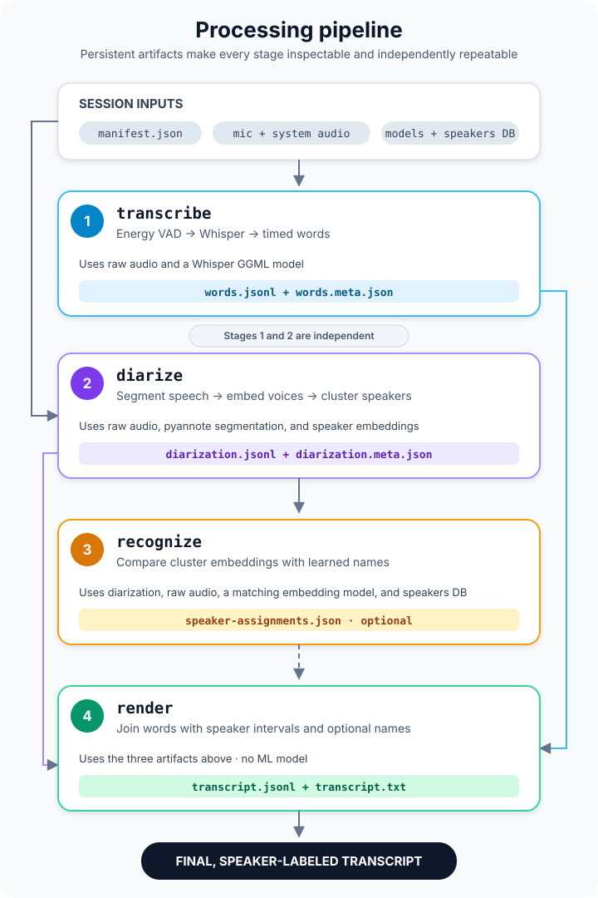

# Processing stages

This guide describes the four persistent processing stages, their models, and
their artifacts. See the [README](../README.md#quick-start) for installation and
a first run.



`transcribe` and `diarize` are independent: neither consumes the other's
output. `recognize` needs diarization, while `render` needs transcription and
diarization and can use recognition when it is available. All timestamps remain
relative to the meeting clock established by `record`.

In the Snap, the first model-backed stage starts the confined model setup
service and waits with a progress bar until the verified per-user cache is
ready. Later stages reuse that cache.

Before a model-backed stage starts, singstone checks the model's file size,
SHA-256 digest and declared purpose against `models.lock`. `--allow-unverified-models`
can explicitly relax that check. Standalone commands generally treat a missing
enabled audio track, model or required upstream artifact as an error, retaining
the existing output. Empty enabled audio and empty diarization are valid empty
inputs; with empty diarization, `recognize` does not open the required model path
or speaker database. The aggregate `process` command keeps its recovery-oriented
behavior: it may skip missing enabled audio and warns on diarization or
recognition failures so a transcript can still be produced. Because it writes
the same artifacts, partial results can replace outputs from earlier tuned stage
runs.

## 1. Transcribe: audio to timed words

```bash
singstone transcribe SESSION \
    --whisper-model ~/.local/share/singstone/models/kb-whisper-small-q5_0.bin \
    --language sv --threads 8
```

**Input:** `manifest.json`, every enabled `audio/*.f32le` track, and a
whisper.cpp GGML model. The audio must be 16 kHz mono float PCM, as produced by
`record`. Every stage also accepts the 16-bit `audio/*.flac` tracks of an
archived session, decoded through the `flac` program.

**Model:** Whisper, through `whisper-rs`. The packaged
`kb-whisper-small-q5_0.bin` is KBLab's Swedish-tuned Whisper Small model in the
official GGML Q5_0 format. It is much smaller than large-v3-turbo and KBLab's
Swedish evaluations report better word error rates than OpenAI large-v3. The
GUI's Swedish transcription toggle is on by default, selecting this model and
the fixed `sv` language. Turning it off selects the packaged multilingual
OpenAI Whisper Small Q5_1 model and automatic language detection. The setting
persists for later meetings. The command line keeps the Swedish default in the
Snap; use both `--whisper-model` and `--language` to choose another combination.
Direct non-Snap builds default to automatic detection. Any compatible,
correctly locked whisper.cpp GGML model can also be supplied. The same loaded
model and inference state are reused for the microphone and system tracks.
Each enabled raw track is read into memory before its transcription pass.

The Snap packages separate CPU and Intel SYCL builds. Its launcher selects the
FP16 SYCL build when a probe can open an Intel GPU, including the Tiger Lake
Iris Xe in the Core i7-1185G7. Intel's oneAPI 2026 GPU support starts with
11th-generation Intel Core integrated graphics; the probe rejects older
devices even when they can run its trivial test kernel, because larger ggml
kernels are not supported there. It prefers Level Zero, retries with OpenCL
when Level Zero fails, and falls back to the CPU build when no supported GPU
runtime works. `SINGSTONE_DISABLE_GPU=1` forces that CPU path. The GUI header
and processing view identify CPU or GPU use, while the Settings page and
transcription log include the device and selected SYCL runtime.

The probe runs with core dumps disabled and records its stages in
`$SNAP_USER_COMMON/gpu-probe.log`. A successful kernel exits directly after
flushing the device name because some Level Zero runtime versions can fail
during process teardown after GPU work has already completed. If probing still
fails, the CPU backend description includes the reason and the log identifies
the last completed discovery stage for both Level Zero and OpenCL attempts.
The launcher points the OpenCL ICD loader directly at the driver bundled inside
the strictly confined Snap rather than using Ubuntu's absolute host path.

The stage performs these operations:

1. It runs an energy-based voice activity detector over 20 ms frames. A frame
   above -45 dBFS is considered speech. The detector keeps 200 ms of hangover,
   rejects raw speech bursts shorter than 250 ms, merges retained regions
   separated by at most 500 ms, and pads them by 300 ms. This detector is signal
   processing and uses no model.
2. Speech regions longer than 25 minutes are split at the quietest 20 ms frame
   within 30 seconds of the target boundary. Regions shorter than one second
   are widened into the surrounding source audio. Only a final inference chunk
   that is still shorter than one second is padded with zero samples, because
   Whisper needs enough samples to process it reliably.
3. Retained audio is passed to Whisper in chunks of at most 30 seconds. The
   decoder uses greedy sampling, token timestamps, no previous-text context and
   the configured thread count.
4. Tokens are grouped at whitespace boundaries, with punctuation attached to
   its word, and timestamps are converted back to meeting-relative
   milliseconds. Empty tokens, bracketed annotations such as `[music]`,
   parenthesized annotations and music-note-only output are removed. Words that
   do not touch a retained VAD region are dropped. Timestamps are clamped to the
   source chunk and made non-overlapping so words do not run backward.
5. Words from both sources are sorted by start time, with microphone words first
   on an exact tie, and written atomically.

The main output is one JSON object per line in `words.jsonl`:

```json
{"source":"system","start_ms":10120,"end_ms":10480,"text":"We"}
```

`words.meta.json` records the format version, output hash, hashes of the audio
tracks that were used, Whisper model hash, language and effective thread count.
`render` checks the recorded hashes and warns if the audio or word file changed
after transcription. Deliberate manual edits remain usable; the warning makes
the provenance mismatch visible.

```json
{
  "format_version": 1,
  "output_file": "words.jsonl",
  "output_sha256": "...",
  "mic_audio_sha256": "...",
  "system_audio_sha256": "...",
  "whisper_model_sha256": "...",
  "language": "en",
  "threads": 8
}
```

Disabled or unavailable input tracks have a `null` audio hash. The metadata
does not include the executable version or the fixed VAD settings, so treat it
as a staleness check rather than a complete recipe for reproducing inference.

## 2. Diarize: audio to anonymous speaker intervals

```bash
singstone diarize SESSION \
    --segmentation-model ~/.local/share/singstone/models/sherpa-onnx-pyannote-segmentation-3-0/model.onnx \
    --embedding-model ~/.local/share/singstone/models/nemo_en_titanet_small.onnx \
    --cluster-threshold 1.0
```

**Input:** `manifest.json`, the optional per-session `meeting.json`, the enabled
audio tracks, and two ONNX models. `process` and `diarize` diarize an enabled
microphone by default. Pass `--diarize-mic=false` to opt out for a legacy or
single-local-speaker workflow.
`words.jsonl` is not an input, so this stage can run before or in parallel with
transcription.

**Models:** sherpa-onnx runs a pyannote speaker-segmentation model and a speaker
embedding model. The segmentation model finds speaker-homogeneous time ranges;
the embedding model represents the voice in each range as a numeric vector.
Fast agglomerative clustering groups similar vectors under numeric cluster IDs.
Both models run on CPU.

Each source is diarized independently, so microphone cluster `0` and system
cluster `0` describe unrelated voices. `--cluster-threshold` controls how
readily clusters are combined. Lower values usually produce more speakers;
values around 0.9 to 1.1 have worked best with
the documented TitaNet model on the tested AMI sample. `--num-speakers N`
replaces automatic speaker-count estimation with that fixed count separately
for each enabled source. Without that flag, a nonzero remote attendee count in
`meeting.json` fixes the system track's speaker count. It never fixes the
microphone count because remote echo can create extra microphone clusters.
Cluster numbers are local implementation labels, not persistent identities:
cluster `2` from one diarization run need not represent cluster `2` after
changing a model or threshold.

The result is sorted by meeting time and written to `diarization.jsonl`:

```json
{"source":"system","start_ms":12000,"end_ms":18300,"cluster":0}
```

Segment timestamps are converted to integer milliseconds and clamped to the
available audio. `diarization.meta.json` records both model hashes, relevant
settings, effective thread count, input audio hashes and the output hash. It
also records the effective microphone-diarization value: `diarize_mic` is true
only when microphone diarization was requested and the output contains at least
one microphone segment. This lets `render` inherit that policy automatically.

```json
{
  "format_version": 1,
  "output_file": "diarization.jsonl",
  "output_sha256": "...",
  "mic_audio_sha256": "...",
  "system_audio_sha256": "...",
  "segmentation_model_sha256": "...",
  "embedding_model_sha256": "...",
  "diarize_mic": true,
  "cluster_threshold": 1.0,
  "num_speakers": null,
  "mic_num_speakers": null,
  "system_num_speakers": 4,
  "threads": 8
}
```

## 3. Recognize: anonymous clusters to learned names

Speaker recognition is optional. Without it, `render` assigns anonymous display
names such as `SPEAKER_00`. These names are deterministic for one fixed set of
diarization segments and assignments, but their numbers can change after either
artifact changes. Use `speaker_id`, such as `spk_3` or `mic_1`, to identify the
underlying source and cluster in a particular diarization result.

```bash
singstone recognize SESSION \
    --embedding-model ~/.local/share/singstone/models/nemo_en_titanet_small.onnx \
    --speakers-db ~/.local/share/singstone/speakers.json \
    --speaker-threshold 0.72
```

**Input:** `diarization.jsonl`, the referenced audio tracks, a sherpa-onnx
speaker embedding model, and the local `speakers.json` database. The database
is built from transcript corrections. Its model SHA-256 digest and embedding
dimension must match the configured model. When present, `meeting.json` also
controls the candidate names considered for each source.

**Model:** any compatible sherpa-onnx speaker embedding model that matches the
speaker database. It will usually be the model used for diarization, and the
documented model is NeMo TitaNet Small, but diarization and recognition do not
require the same model. Recognition does not run the segmentation model and
does not transcribe speech.

Before scoring, the stage writes normalized chunk vectors to
`embeddings.jsonl`. Each diarization segment of length `L` is split into
`ceil(L / 10000 ms)` equal windows. Segments of at least ten seconds therefore
produce windows between five and ten seconds; shorter segments produce one
window. Even a window shorter than 1.5 seconds is retained in the artifact for
completeness, but it is never learned or scored by itself.

```json
{"source":"system","start_ms":12000,"end_ms":18300,"cluster":0,"embedding":[0.01,-0.02]}
```

The vector is abbreviated here; the documented model writes 192 values.

`embeddings.meta.json` records format and output hashes, the diarization hash,
both audio hashes, embedding-model hash, thread count, the 10000 ms window and
the 1500 ms learning minimum. Correction reuses the artifact only when its
recorded output hash matches `embeddings.jsonl` and its diarization, audio and
embedding-model hashes match the current inputs. Otherwise, when a model is
configured, correction regenerates it on demand.

For every distinct `(source, cluster)` pair, recognition then:

1. Uses that cluster's chunks of at least 1.5 seconds as query dots. With no
   usable query dot, the cluster has no candidate.
2. Computes the normalized mean query dot and compares it with the cached
   centroid of every allowed person, retaining the five closest people (or all
   of them when fewer than five are available).
3. For each retained person and each query dot, averages the three highest
   cosine similarities to that person's stored dots, or all dots when the
   person has fewer than three. The person's score is the median of those
   per-query-dot values.
4. Records the highest score as `best_candidate` and assigns that name only
   when the score reaches `--speaker-threshold`. A lower threshold names more
   clusters but raises the chance of a false match. The default is `0.72`.

For system clusters, known remote attendees are the allowed candidates. For
microphone clusters, only known local attendees are allowed. A source remains
unrestricted when its attendee list is empty or its corresponding end has
unnamed people. This is a filtered view of the speaker database; the database
on disk is unchanged.

The version 2 speaker database stores only a model identity and unit-length
vectors ("dots") for each name. Dot count is the weight; dots have no dates,
provenance, or serialized weights. A normalized mean centroid is computed at
load time for candidate prefiltering but is not written to disk.
Names that differ only by Unicode case or whitespace are merged when the
database is loaded, keeping the spelling from the record with the most dots.
Manual corrections reuse that stored spelling for matching names.

```json
{
  "format_version": 2,
  "embedding_model": {"name":"nemo_en_titanet_small","sha256":"...","dimension":192},
  "speakers": {"Alice":{"embeddings":[[0.01,-0.02]]}}
}
```

The stored vector is likewise abbreviated in this example.

On first use, a legacy database without `format_version` is copied to
`speakers.json.v1.bak` (then `.v1.bak.2`, `.3`, and so on if needed), its
vectors are imported under the same names into a version 2 database, and a
line on stderr reports the counts. Each legacy vector was the mean of a whole
diarization cluster, so it counts as one voice sample; a vector from a merged
cluster stays in the database until later corrections outweigh it.

The versioned `speaker-assignments.json` contains every diarized cluster, even
when it has no usable embedding or confident match:

```json
{
  "format_version": 1,
  "provenance": {
    "diarization_file": "diarization.jsonl",
    "diarization_sha256": "...",
    "embedding_model_sha256": "...",
    "speakers_database_sha256": "...",
    "meeting_sha256": "...",
    "speaker_threshold": 0.72
  },
  "assignments": [
    {
      "source": "system",
      "cluster": 0,
      "best_candidate": "Alice",
      "score": 0.82,
      "speaker": "Alice"
    }
  ]
}
```

`best_candidate` and `score` remain present below the threshold, while
`speaker` is omitted. This makes threshold problems distinguishable from
embedding failures. Recognition is performed separately for the microphone and
system sources, and the same learned name may legitimately match more than one
cluster.

### Manual assignment and correction

Naming or changing a line creates a lock on that line's exact rendered
`[start_ms, end_ms]` and source. It does not rename the rest of the diarization
cluster and does not edit `speaker-assignments.json`. Locks are stored in the
versioned `speaker-corrections.json` artifact:

```json
{
  "format_version": 1,
  "corrections": [
    {"source":"system","start_ms":41200,"end_ms":47800,"speaker":"Alice"}
  ]
}
```

A newer range replaces older ranges that it overlaps on the same source. At
render time, a word takes the correction's name when its midpoint is inside the
range. The resulting utterance has `"locked":true`; its `speaker_id` remains
the underlying `spk_N` or `mic_N` cluster ID. Locks are never changed by
recognition, proposals, rendering, or reprocessing.

An entry with `"inferred":true` is a name carried forward from a lock to a
later line of the same voice, not a lock:

```json
{"source":"system","start_ms":52950,"end_ms":58560,"speaker":"Alice","inferred":true}
```

Its words take the name but the utterance is not locked, nothing is learned
from it, and it stays a candidate for later proposals. A lock replaces the
inferred entries it overlaps and wins where both cover a word; an inferred
entry replaces only other inferred entries. Like locks, inferred entries are
kept across reprocessing.

Names assigned by hand before this version lived in
`speaker-assignments.json` and are not carried over; reprocessing such a
session loses those names.

When the embedding model is configured, correction also learns every
same-source chunk for which at least half of the chunk overlaps the range,
excluding chunks shorter than 1.5 seconds. If another name previously owned
the lock or is the cluster's current first guess, vectors with cosine
similarity at least `0.999` to a learned vector are removed from that old name.
An equivalent vector already stored under the chosen name is not appended
again. With a configured model, learning preparation must succeed before the
lock is saved; a rendering failure restores the previous corrections. The
database is updated only after rendering succeeds.
Without the model, the line is still locked and rendered, but learning and
unlearning are skipped. Microphone corrections are stored and learned in the
same way as system-track corrections.

The app marks a locked line as learned when one of its chunks is stored under
the line's name in the database (cosine similarity at least `0.999`). This is
derived when the session is shown, not recorded: the mark disappears when the
speaker is deleted, or when reprocessing moves the chunk boundaries.

The command-line equivalent is:

```bash
singstone correct SESSION \
    --source system --start-ms 41200 --end-ms 47800 --name Alice \
    --embedding-model ~/.local/share/singstone/models/nemo_en_titanet_small.onnx \
    --speakers-db ~/.local/share/singstone/speakers.json
```

After learning, correction scores later, unlocked utterances from the same
source and cluster. A row is proposed when the new name beats its current name
by at least `0.05`, or, for an unnamed row, when the new score reaches the
speaker threshold. Earlier rows are never proposed. `correct` prints the
outcome and each forward proposal as JSON lines but does not apply proposals.
The GUI applies every proposed row without asking, as an inferred entry. Only
the line named by hand is locked and learned; rows that are not proposed keep
their current name.

## 4. Render: intermediate artifacts to the final transcript

```bash
singstone render SESSION
```

**Input:** `manifest.json`, `words.jsonl`, `diarization.jsonl`, their metadata
sidecars when present, optionally
`speaker-assignments.json`, optionally `speaker-corrections.json`, optionally
`hidden-sources.json`, and the audio tracks when both are available. Missing
assignment, correction, and hidden-source data is allowed, but malformed or
unsupported assignment, correction, hidden-source, or diarization metadata is
an error. This stage uses no ML model and is fast.

When both audio tracks are available, `render` builds 10 ms RMS envelopes and
examines every non-overlapping two-second system-audio window with enough
activity. Correlated windows become delay-and-gain reference points only when
at least two nearby candidates agree on the delay. Nearby means within 180
seconds, so reference points can exist in one part of a meeting without a bad
or changed section vetoing the whole session.

For each microphone word, `render` separately estimates delay and gain from up
to three nearest reference points before the word and up to three after it,
within the same 180-second horizon. Passing the audio test with either estimate
marks the word as echo, which lets volume, microphone gain, delay, or headphone
changes take effect from whichever side already reflects the new path. A word
whose microphone energy clearly exceeds the predicted leak stays unmarked as
local speech or double talk. A comparison of timed word sequences then runs
over words not marked by the audio pass and can mark a text match confirmed by
correlated audio. If an audio track cannot be read, only the stricter
long-sequence text fallback is available. No words are deleted, and the raw
`words.jsonl` remains unchanged.

Every detected run is written to `echo-detections.jsonl`, including the two
spans, `words` count, evidence kind, and optional text similarity, audio
similarity, and estimated delay. Audio-first detections omit text similarity.
An empty file means no microphone words were detected as echo. Rendering also
removes the obsolete `leakage-suppressions.jsonl` artifact when present.

For each word, `render` considers only diarization segments from the same audio
source. It chooses the cluster with the greatest timestamp overlap. When there
is no overlap, it can use the nearest segment within 500 ms; otherwise the word
is assigned to `unknown`.

Because microphone diarization is the processing default, microphone words
normally use microphone cluster IDs and recognized or anonymous names instead
of the local name in `manifest.json`. `render` reads the effective value from
`diarization.meta.json`: it is true only when microphone diarization was
requested and at least one microphone segment was produced. When it is false,
microphone words use the manifest's local name with speaker ID `local`; when it
is true, a word with no overlapping or nearby microphone segment becomes
`unknown`. For legacy sessions without metadata, `render` infers the choice
from the presence of microphone segments.
`--diarize-mic` and `--diarize-mic=false` provide explicit overrides; an
override that conflicts with current metadata is rejected instead of silently
changing speaker attribution.

Unrecognized clusters receive `SPEAKER_NN` display names in first-seen segment
order. `NN` is a display counter rather than the cluster number. Recognized
names replace only the display name; the source and numeric cluster remain
visible through IDs such as `spk_3` or `mic_1`.

Corrections are then overlaid per word using the midpoint rule described above.
They override recognized and anonymous display names without replacing the
cluster ID. Grouping starts a new utterance when the lock state changes, so a
confirmed range cannot be merged into an unlocked row.

Audio-detected words form their own microphone utterances and carry
`"echo":true` in `transcript.jsonl`. Surrounding local words form separate,
unmarked utterances, and system utterances are never marked. Older transcripts
that stored a string in `echo` still open: any old string value is read as
`true`. The text transcript adds `[echo]` after the speaker name.

Adjacent words are grouped into utterances. A new utterance starts when the
speaker ID, display name, lock state, or echo flag changes, the silence between
words exceeds one second, or an utterance has reached 15 seconds and ends with
sentence punctuation. Whitespace and punctuation spacing are normalized, and
utterances from both sources are sorted on the common meeting timeline.

`hidden-sources.json` can leave one or both sources out of the final transcript:

```json
{
  "format_version": 1,
  "hidden": ["mic"]
}
```

Hidden-source utterances are omitted from `transcript.jsonl` and
`transcript.txt`; no other artifact changes. Use the app to toggle a source,
or edit the file and run `singstone render SESSION`. Remove a source from
`hidden`, or remove the file, and render again to bring its lines back.

The stage replaces the canonical `transcript.jsonl` and readable
`transcript.txt` atomically one file at a time:

```json
{"start_ms":12340,"end_ms":15780,"source":"system","speaker_id":"spk_0","speaker":"Alice","text":"I think we should ship it on Friday.","locked":true}
```

Unlocked utterances omit the `locked` field.

```text
[00:00:12.340] Alice: I think we should ship it on Friday.
```

Before rendering, singstone compares the available provenance hashes with the
current intermediate files and audio. Edited or replaced word and diarization
artifacts produce warnings but remain renderable. Speaker assignments are
treated more strictly: if their recorded diarization path or hash does not
match, all first-guess names are discarded and clusters remain anonymous unless
a correction covers them. Corrections are keyed by source and time range, not
cluster, so they remain active when diarization settings or cluster numbers
change. This staleness check does not compare the current speaker database,
embedding model or recognition threshold; rerun `recognize` yourself after
changing any of those inputs.

## Rerun recipes

| Problem or goal | Commands to rerun |
|---|---|
| Incorrect words or language | `transcribe`, then `render` |
| Too many or too few speaker clusters | `diarize`, `recognize`, then `render` |
| Change one line's speaker | Use the app, or `correct` with that row's exact source and time range |
| Refresh automatic first-guess names | `recognize`, then `render` |
| Manually edited words | `render` |
| Manually edited speaker segments | `recognize`, then `render`; or only `render` for anonymous names |
| Leave out the microphone or system-audio lines | Use the app, or edit `hidden-sources.json`, then `render` |
| Anonymous transcript with no speaker database | Skip `recognize`; run `render` |
| Multiple people are listed in the room | Save meeting details, then `diarize`, `recognize`, and `render` |
| Changed who was in the meeting | `recognize`, then `render` when candidate names changed; otherwise `render` |

Changing attendee names also changes the recognition candidate set, so rerun
`recognize` before `render` when those names should be matched automatically.
Every rerun recipe preserves `speaker-corrections.json` and
`hidden-sources.json`; `process` and the individual `transcribe`, `diarize`,
`recognize`, `render`, `correct`, and `archive` stages never edit or delete
either file.
The app's **Process again** flow therefore keeps confirmed lines. To discard
every confirmed line, remove `speaker-corrections.json` manually.

The VAD thresholds and chunk sizes described above are currently fixed. Whisper
chunks do not overlap and do not share text context, so transcription quality
can degrade at a 30-second boundary. Stop `record` before processing its session.
`transcribe` and `diarize` may run concurrently because they write disjoint
artifacts. Concurrent runs of the same stage, or a downstream stage while its
upstream artifact is still being written, are unsupported.
